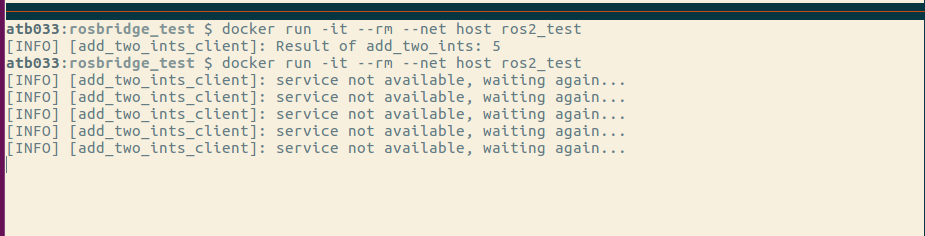

# Bug Report

To replicate the bug, build the Dockerfiles

```shell
docker build -f Dockerfile_bridge -t bridge .
docker build -f Dockerfile_ros1 -t ros1_test .
docker build -f Dockerfile_ros2 -t ros2_test .
```

- Run `bridge` and `ros1_test` in detatched mode

```shell
docker run -d --rm --net host bridge
docker run -d --rm --net host ros1_test
```

- Run `ros2_test` in interactive-terminal mode

```shell
docker run -it --rm --net host ros2_test
```

The result is


- When the above step was repeated, the service becomes unavailable

```shell
docker run -it --rm --net host ros2_test
```

This led to:


- Upon restarting the `ros1_bridge` docker, the service becomes available again
