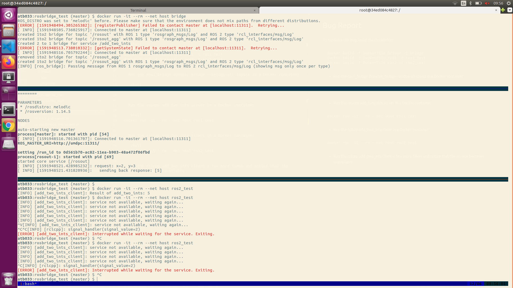
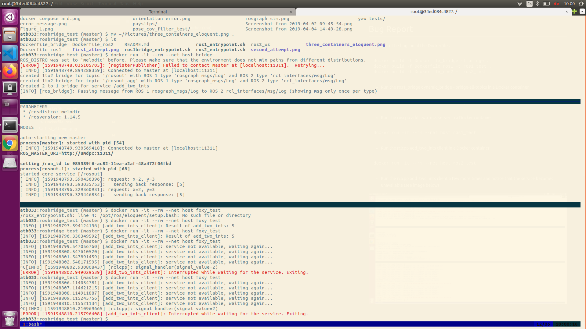

# Bug Report

To replicate the bug, build the Dockerfiles

```shell
docker build -f Dockerfile_bridge -t bridge .
docker build -f Dockerfile_ros1 -t ros1_test .
docker build -f Dockerfile_ros2 -t ros2_test .
```

- Run the ros1_bridge dynamic_bridge --bridge-all-topics in a Docker container

```shell
docker run -it --rm --net host bridge
```

- Run the roscpp add_two_ints server in a Docker container

```shell
docker run -it --rm --net host ros1_test
```

- Run the rclcpp add_two_ints client in a Docker container

```shell
docker run -it --rm --net host ros2_test
```

- Run the rclcpp add_two_ints client a few more times and notice that the service becomes unavailable (see images below)

*ROS version: eloquent*


*ROS version: foxy*

